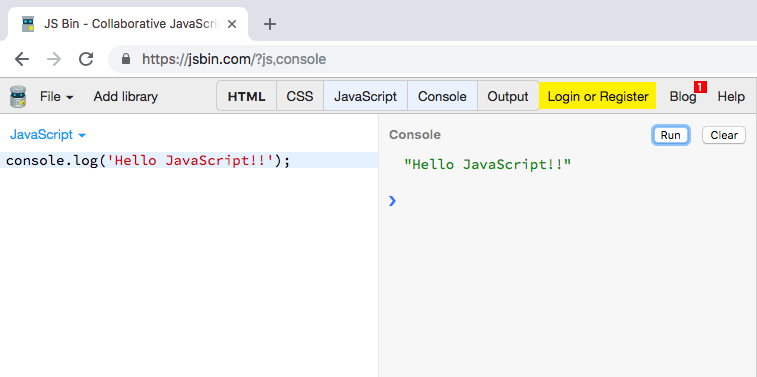

# 初めてのプログラミングをJavaScriptで学ぶ
## 本書について
本書は、JavaScript初心者に向けて作成されています。  
また、初めてプログラミングを経験する方にも取り組んで頂けるような構成としています。  
そのため、一般に販売されているようなJavaScript入門書の代わりではなく、「初めてのプログラミングをJavaScriptで学ぶ」方向けとなっています。

## JavaScriptの実行環境
JavaScriptを実行する方法はいくつもありますが、JS Binというサービスを紹介します。  
ここ（[https://jsbin.com/?js,console](https://jsbin.com/?js,console)）で、以下の参考画像の様にJavaScriptを実行できます。  
何かコードを書いて実行する際は、`Run`ボタンを押してください。

## 目次
* [Lesson 01 : 出力](./docs/lesson01.md)
* [Lesson 02 : 計算](./docs/lesson02.md)
* [Lesson 03 : Boolean(bool型)と比較演算子と論理演算子](./docs/lesson03.md)
* [Lesson 04 : 変数とは？](./docs/lesson04.md)
* [Lesson 05 : 条件分岐](./docs/lesson05.md)
* [Lesson 06 : 練習問題 条件分岐と変数](./docs/lesson06.md)
* [Lesson 07 : 関数とは？](./docs/lesson07.md)
* [Lesson 08 : ループ処理](./docs/lesson08.md)
* [Lesson 09 : 配列とループ](./docs/lesson09.md)
* [Lesson 10 : Object（オブジェクト）で表現の幅を広げる](./docs/lesson10.md)
* [Lesson 11 : JavaScriptとは](./docs/lesson11.md)
